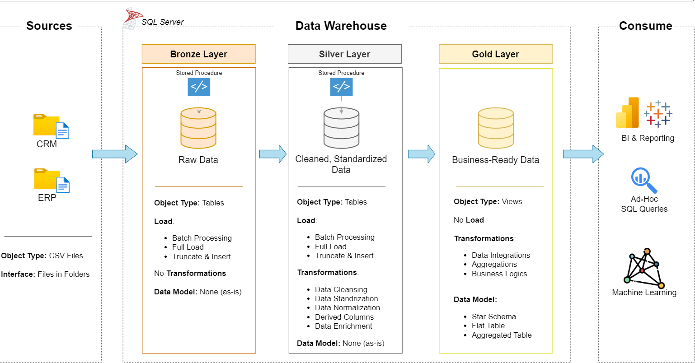
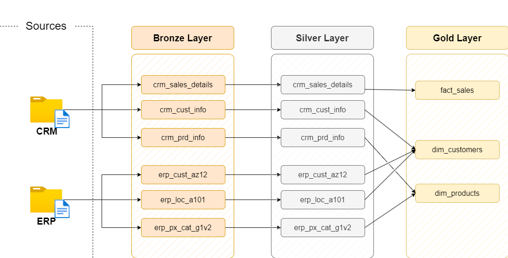
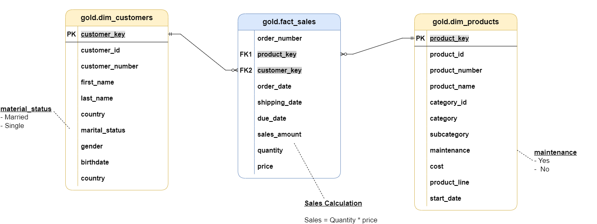
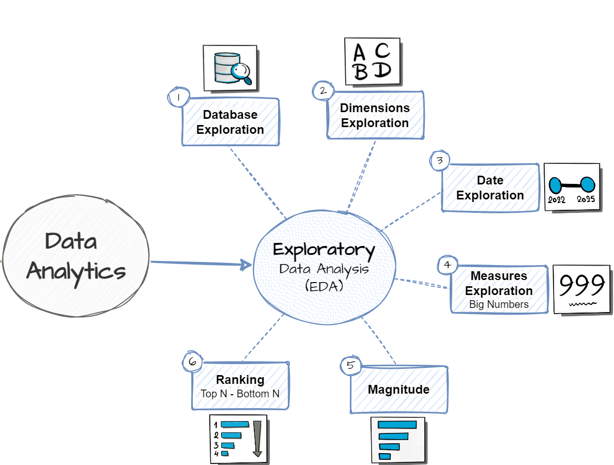

# 🏗️ SQL Data Warehouse & Analytics — End-to-End Project

> **Building a production-grade Data Warehouse from scratch — Medallion Architecture, Star Schema modeling, and 13-module EDA — entirely in SQL.**

📧 [i.am.varungautam@gmail.com](mailto:i.am.varungautam@gmail.com) &nbsp;|&nbsp; 💼 [LinkedIn](https://www.linkedin.com/in/iamvarungautam/) &nbsp;|&nbsp; 💻 [GitHub](https://github.com/iamvarungautam)

---

## 📌 What This Project Is

A **full-lifecycle data engineering and analytics project** built on Microsoft SQL Server. Starting from raw, disconnected CRM and ERP data, I designed and implemented a complete analytical system — ETL pipelines, data quality layers, dimensional modeling, and 13 structured EDA modules delivering actionable business insights.

No drag-and-drop tools. No BI shortcuts. Pure SQL engineering.

---

# 🏗️ Phase 1 — Data Warehousing

## Data Architecture

<p align="center">
  
</p>

The project follows a **Medallion Architecture** — a layered approach that separates raw ingestion, transformation, and analytics-ready data into three distinct zones:

| Layer | Purpose |
|---|---|
| 🥉 **Bronze** | Raw ingestion from CRM + ERP — unchanged, traceable, auditable |
| 🥈 **Silver** | Cleansing, standardization, deduplication, business rule validation |
| 🥇 **Gold** | Star Schema dimensional model — analytics-ready, query-optimized |

---

## 🔄 Data Flow

<p align="center">
  
</p>

The pipeline integrates CRM and ERP datasets through a structured ETL/ELT workflow:

1. Extract data from CRM and ERP source systems
2. Load raw data into Bronze Layer
3. Cleanse and standardize data in Silver Layer
4. Integrate and reconcile business entities across systems
5. Build dimensional models in Gold Layer
6. Deliver analytics-ready datasets for reporting

---

## ⭐ Data Model — Star Schema

<p align="center">
  
</p>

The Gold Layer is built on a clean **Star Schema** optimized for analytical reporting:

| Table | Type | Description |
|---|---|---|
| `Fact_Sales` | Fact | Core transactional grain — revenue, quantity, orders |
| `Dim_Customer` | Dimension | Customer attributes, geography, categories |
| `Dim_Product` | Dimension | Product hierarchy, categories, subcategories |
| `Dim_Date` | Dimension | Full calendar spine for time-intelligence queries |

This structure enables high-performance slicing across customers, products, and time — the three axes every sales analytics question reduces to.

---

## ⚙️ Data Engineering Components

### ETL / ELT Pipeline
- Data extraction from heterogeneous source systems
- Staged loading with full auditability
- Incremental and full-load transformation logic

### Data Quality Management
- Duplicate detection and handling
- Missing value treatment
- Standardization rules and business rule enforcement
- Data enrichment and validation checks

### Data Integration
- CRM + ERP business key reconciliation
- Master data alignment across systems
- Unified customer and product entities

### Dimensional Modeling
- Fact table design at transactional grain
- Conformed dimensions for consistent reporting
- Star Schema implementation for query performance

---

# 📊 Phase 2 — Exploratory Data Analysis (EDA)

<p align="center">
  
</p>

After building the warehouse, I ran a **structured 13-module EDA** on the Gold Layer — moving from database validation all the way to reusable business reports.

---

## 🔬 Foundational EDA (Modules 1–6)

### 1️⃣ Database Exploration
Validated the analytical dataset before any analysis:
- Database inventory and schema review
- Table structure and record count verification
- Data completeness checks and readiness assessment

### 2️⃣ Dimension Exploration
Profiled the business entities available for slicing:

**Customer Dimension** — distribution, geographic spread, customer categories  
**Product Dimension** — category hierarchy, subcategory breakdown, product distribution

Techniques: `DISTINCT` analysis, category profiling, data distribution checks

### 3️⃣ Date Exploration
Established the temporal boundaries of the dataset:
- Earliest and latest transaction dates
- Total historical coverage period
- Time span available for trend analysis

### 4️⃣ Measures Exploration
Established baseline KPIs across the business:

| Metric | SQL Function |
|---|---|
| Total Sales Revenue | `SUM()` |
| Total Orders | `COUNT()` |
| Total Quantity Sold | `SUM()` |
| Average Selling Price | `AVG()` |

### 5️⃣ Magnitude Analysis
Evaluated business performance scale across dimensions:
- Sales by Product Category
- Revenue by Customer
- Orders by Country / Region
- Quantity Sold by Product

Identified major revenue drivers, high-volume categories, and customer contribution patterns.

### 6️⃣ Ranking Analysis
Identified top and bottom performers using window functions:

**Customer Rankings** — Top and bottom revenue contributors  
**Product Rankings** — Best-selling and lowest-performing products

SQL: `ROW_NUMBER()`, `RANK()`, `DENSE_RANK()`

---

## 📈 Advanced Analytics (Modules 7–11)

### 7️⃣ Change Over Time Analysis
- Monthly and quarterly sales trends
- Revenue growth patterns over the analysis period
- Seasonal performance identification

### 8️⃣ Cumulative Analysis
- Running revenue totals using `SUM() OVER(ORDER BY date)`
- Cumulative order tracking
- Progressive performance benchmarking

### 9️⃣ Performance Analysis
- Year-over-Year revenue comparison
- Product performance vs. category average
- Customer performance vs. overall average

### 🔟 Data Segmentation
Classified customers and products into value tiers using `CASE WHEN` logic:

| Segment | Criteria |
|---|---|
| High Value | Top revenue contributors |
| Medium Value | Mid-range performance |
| Low Value | Bottom contributors |

### 1️⃣1️⃣ Part-to-Whole Analysis
Revenue contribution analysis:
- Category revenue share as % of total
- Product contribution % within category
- Customer revenue share across the base

---

## 📋 Business Reports (Modules 12–13)

### 1️⃣2️⃣ Customer Report (`report_customers.sql`)
A reusable, comprehensive customer analytics report covering:
- Total revenue per customer
- Order volume and purchase frequency
- Customer ranking by revenue tier
- Segmentation classification

### 1️⃣3️⃣ Product Report (`report_products.sql`)
A reusable product performance report covering:
- Revenue and sales volume by product
- Category-level performance analysis
- Product ranking within and across categories
- Identification of star performers and laggards

---

## 🧠 SQL Concepts Applied

```sql
✅ CTEs                    — multi-step transformations, readable logic
✅ Window Functions        — RANK(), DENSE_RANK(), ROW_NUMBER(), SUM() OVER()
✅ Stored Procedures       — ETL automation and reusable report logic
✅ Multi-table JOINs       — CRM + ERP integration across fact and dimensions
✅ Aggregate Functions     — SUM, AVG, COUNT with GROUP BY / HAVING
✅ CASE WHEN               — segmentation and conditional classification
✅ Date Functions          — trend analysis, period calculations
✅ Subqueries              — nested analytical logic
✅ Data Quality Checks     — duplicate detection, null handling, validation
```

---

# 🔍 Business Questions This Project Answers

- Who are the **top revenue-generating customers** and what % of total revenue do they represent?
- Which **product categories** drive the most sales — and which consistently underperform?
- How has **revenue trended month-over-month** and where are the seasonal peaks?
- What does the **customer value distribution** look like across high/medium/low tiers?
- Which products should be **deprioritized** based on sustained low performance?

---

# 🛠️ Technology Stack

| Area | Tools |
|---|---|
| **Database** | Microsoft SQL Server |
| **Infrastructure** | Docker Desktop (containerized SQL Server) |
| **Development** | VS Code + SQL Server Extension |
| **Version Control** | Git + GitHub |
| **Design & Docs** | Draw.io, Notion, Markdown |
| **Hardware** | Apple MacBook Air (M-Series), macOS |

---

# 📂 Repository Structure

```text
data-warehouse-project/
│
├── datasets/                          # Source CRM + ERP data (CSV)
│
├── docs/
│   ├── data_architecture.png          # Medallion architecture diagram
│   ├── data_flow.png                  # ETL pipeline flow
│   ├── data_model.png                 # Star Schema diagram
│   ├── eda_roadmap.png                # EDA module map
│   ├── data_catalog.md                # Field definitions and metadata
│   └── naming_conventions.md         # Naming standards used
│
├── scripts/
│   ├── bronze/                        # Raw ingestion scripts
│   ├── silver/                        # Cleansing + transformation
│   └── gold/                          # Dimensional model creation
│
├── analytics/
│   ├── 01_database_exploration.sql
│   ├── 02_dimensions_exploration.sql
│   ├── 03_date_range_exploration.sql
│   ├── 04_measures_exploration.sql
│   ├── 05_magnitude_analysis.sql
│   ├── 06_ranking_analysis.sql
│   ├── 07_change_over_time_analysis.sql
│   ├── 08_cumulative_analysis.sql
│   ├── 09_performance_analysis.sql
│   ├── 10_data_segmentation.sql
│   ├── 11_part_to_whole_analysis.sql
│   ├── 12_report_customers.sql
│   └── 13_report_products.sql
│
├── tests/
├── README.md
├── LICENSE
└── .gitignore
```

---

# 👨‍💼 About Me

**Varun Gautam** — MBA (HR + Business Analytics), IIM Ranchi

I'm an HR professional with a serious focus on analytics. This project reflects my conviction that the best business decisions come from well-engineered data. I built this end-to-end to go beyond classroom SQL and demonstrate real data engineering depth — architecture design, pipeline development, quality management, and business analysis in one cohesive project.

Currently working in People Analytics & HRBP at DS Group (FMCG). My goal is to sit at the intersection of business, data, and decision-making.

📧 [i.am.varungautam@gmail.com](mailto:i.am.varungautam@gmail.com)  
💼 [linkedin.com/in/iamvarungautam](https://www.linkedin.com/in/iamvarungautam/)  
💻 [github.com/iamvarungautam](https://github.com/iamvarungautam)

---

> ⭐ If this project resonates with you, let's connect.
